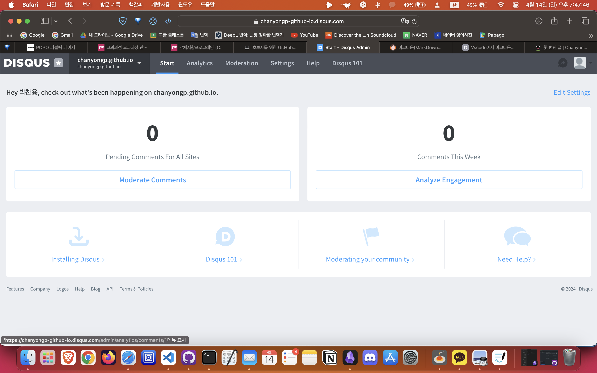

## 1. 소개
첫번째 github blog 글입니다.  
jekyll 기반이며, 테마는 chirpy입니다. 

블로그 제작 및 글 작성에 참조한 글들은 아래 Reference를 참조해주시면 됩니다.  
추가적으로 disqus 댓글 서비스를 연동시켰으며,  
이는 아래 사이트 중 https://jongsky.tistory.com/26 에서 많은 도움을 받았습니다.

</img>

문의사항은 댓글 혹은 메일로 보내주세요.  
읽어주셔서 감사합니다! 😀

## Reference :  
https://supermemi.tistory.com/entry/  나만의-블로그-만들기-Git-hub-blog-GitHubio  
https://wlqmffl0102.github.io/posts/Making-Git-blogs-for-beginners-3/  
https://jojoldu.tistory.com/288  
https://velog.io/@coastby/Git-GitBlog-Chirpy-Jekyll-Theme-적용하기  
https://ree31206.tistory.com/entry/  github-pages-블로그-만들기-테마-적용하기Chirpy  
https://seong6496.tistory.com/270  

https://jamesu.dev/posts/2020/01/03/adding-disqus-comment-service-to-jekyll/  
https://present4n6.tistory.com/8  
https://jongsky.tistory.com/26